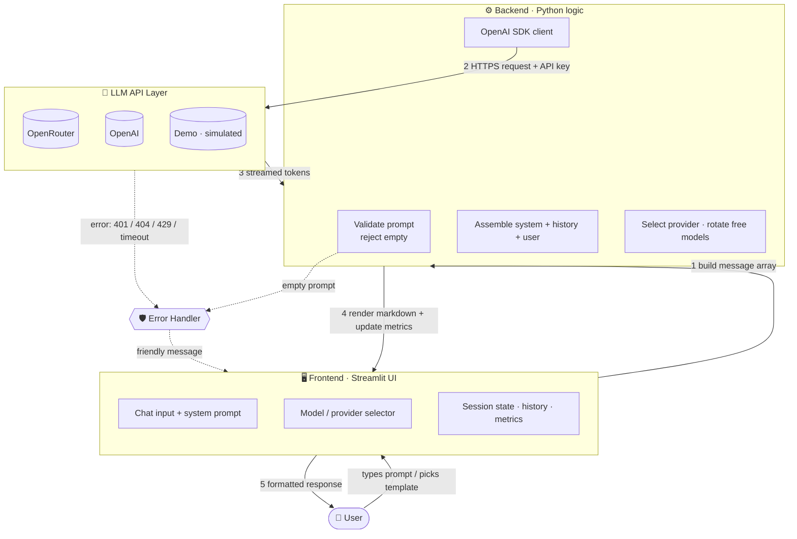

# 🏗️ AI Application Architecture — AI Workspace

### Assignment 5 — Visibility Bots Innovation Lab · Fellowship Week 1

**Author:** Rana Muhammad Haseeb Khan · **Track 2: NLP & AI Agents**

This document maps the request/response pipeline of the **AI Workspace** app (Assignment 3): a Streamlit frontend, a Python backend, and a pluggable LLM API layer (OpenRouter / OpenAI).

---

## 📊 Architecture Diagram

**Linear view:** `User → Frontend → Backend → LLM API → Response`

---

## 🔄 Request Flow

1. **User → Frontend.** The user types a question in the chat input (optionally selecting a *system prompt persona*, a *prompt template*, and a *model/provider*). Streamlit captures the input and appends it to the active session's history in `st.session_state`.
2. **Frontend → Backend (validation).** The backend first **validates** the prompt — empty/whitespace-only input is rejected before any network call.
3. **Backend (assembly).** It builds the message array the API expects:
   `[{system prompt}, …conversation history…, {new user message}]`. Templates are prepended to the user text here.
4. **Backend (routing).** The chosen **provider** determines the `base_url` (OpenRouter vs. OpenAI). For free OpenRouter models, a **model-rotation pool** is used so a rate-limited model falls back to the next.
5. **Backend → LLM API.** The `OpenAI` SDK client issues an **HTTPS `POST /chat/completions`** with the API key in the `Authorization` header and `stream=True`.

## 📥 Response Flow

1. **LLM API → Backend (streaming).** The model returns **Server-Sent Events** — token deltas arriving incrementally rather than one large payload.
2. **Backend → Frontend (progressive render).** Each delta is concatenated and pushed to a live placeholder (`st.empty().markdown(...)`), producing the typing-cursor effect. Markdown (code blocks, tables, lists) renders in place.
3. **Persist & measure.** On completion the full reply is saved to session history, and **telemetry** is updated — token estimate, response latency (`time.time()` delta), and message counts — then a **rerun** repaints the metric cards so they reflect the new totals immediately.
4. **Frontend → User.** The user sees the formatted answer plus a caption: `⏱️ latency · 🔌 provider · 🎯 model`.

## 🛡️ Error Handling

The backend wraps the API call in a `try/except` and maps failures to clear, actionable messages instead of raw stack traces:

| Failure | Trigger | User-facing message |
|---|---|---|
| **Empty prompt** | blank/whitespace input | *"Cannot send an empty prompt."* (caught before any call) |
| **Invalid API key** | `401 / authentication` | *"🔑 Invalid API key — check your credentials."* |
| **Model unavailable** | `404 / no endpoints` | *"🚫 Model unavailable — pick a different model."* |
| **Rate limit / quota** | `429` | *"⏳ Rate limit reached — wait or try another model."* |
| **Connection failure** | timeout / network | *"🌐 Connection failed — check your internet."* |
| **Missing key** | no key + non-demo provider | prompt to add a key or switch to **Demo mode** |

Additional resilience: **model rotation** absorbs transient free-tier `429`s automatically, and **Demo (simulated) mode** lets the whole app run with no key at all. The success-path `st.rerun()` sits *outside* the `try/except` so it can't be swallowed by the exception handler.

## 🔌 API Integration

- **Unified client.** The OpenAI Python SDK is the single integration point; swapping providers is just a different `base_url` + key — OpenRouter is OpenAI-API-compatible, so no code fork is needed.
- **Provider abstraction.** A `PROVIDERS` config maps each provider to its `base_url`, env-var key name, and model catalog (OpenAI = paid, OpenRouter = free, Demo = simulated).
- **Secrets.** Keys are read from environment variables / `.env` (or entered at runtime in the sidebar) — **never hard-coded** and excluded from git via `.gitignore`.
- **Streaming contract.** `stream=True` yields `choices[0].delta.content` chunks; `max_retries=0` on the client hands retry control to the app's own rotation logic for predictable behavior.
- **Stateless API, stateful app.** The LLM API itself holds no memory — conversation continuity is achieved by the backend **replaying the full message history** on every request.

---

*Architecture documented by Rana Muhammad Haseeb Khan · Visibility Bots Fellowship — 2026.*
