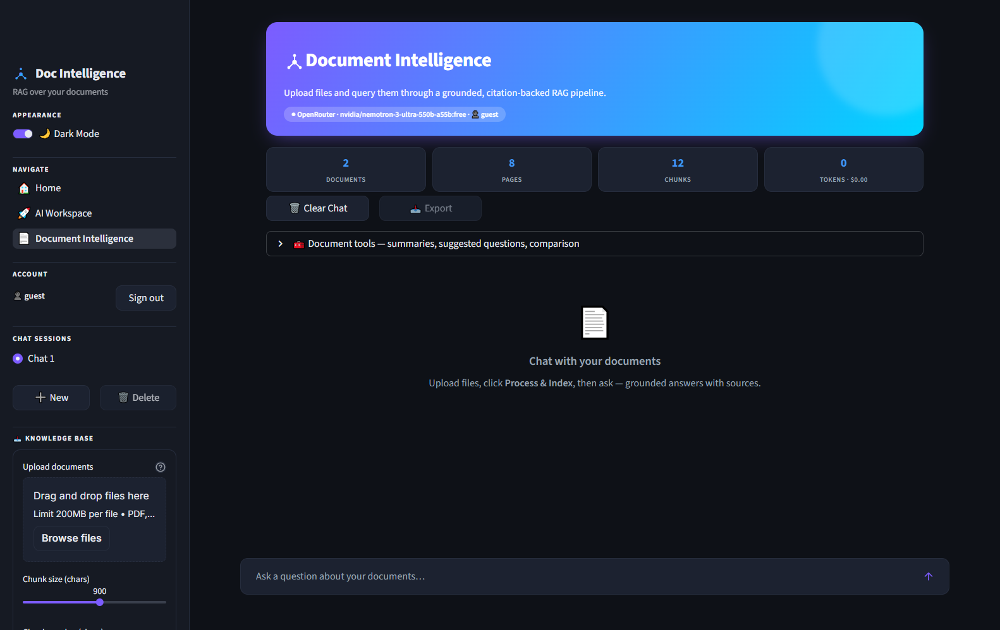
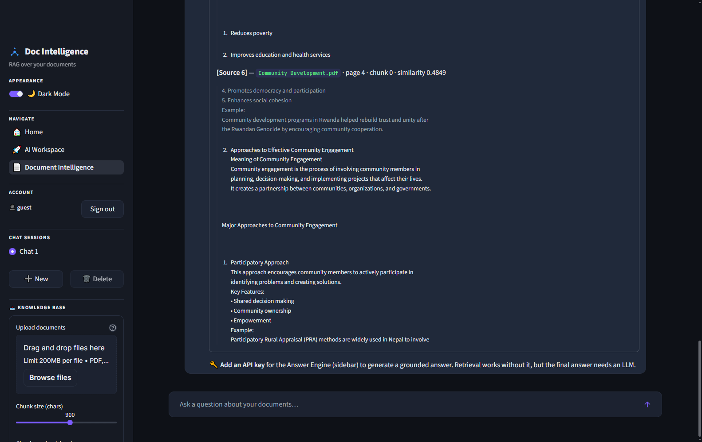
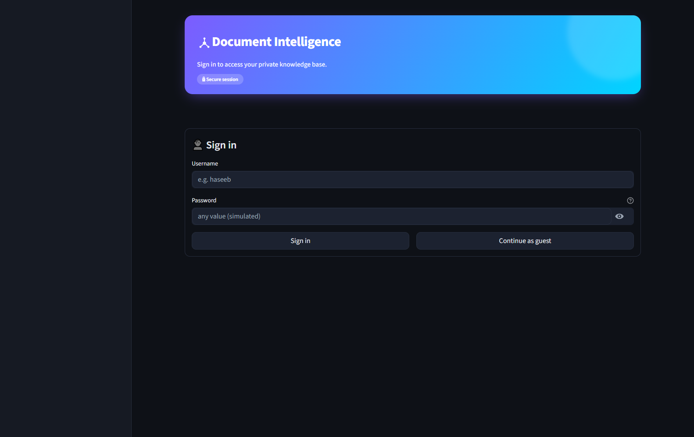
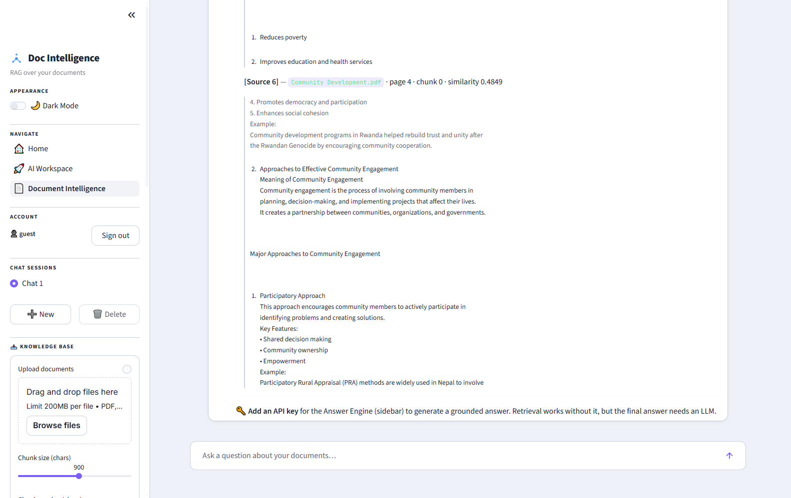
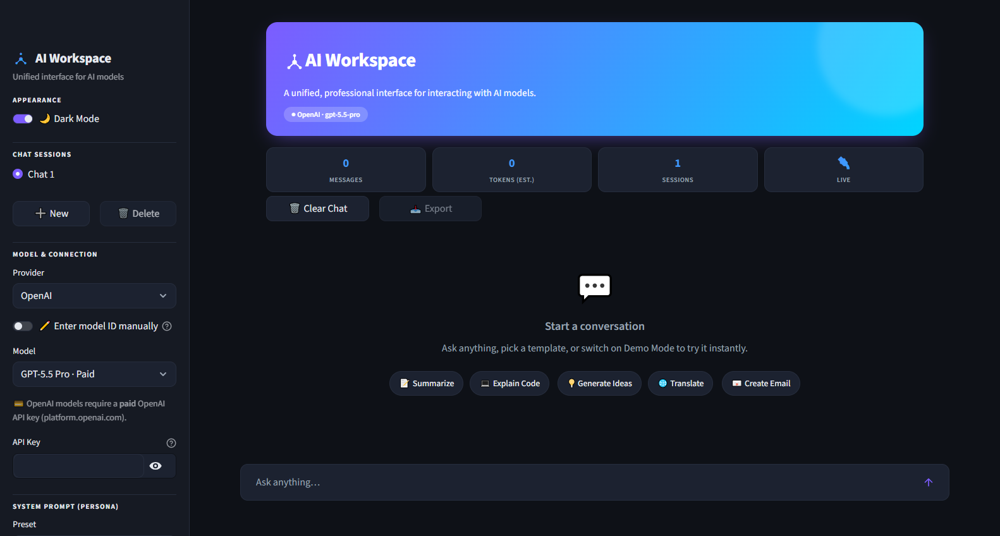

<div align="center">

# 🚀 AI Agent Fellowship 2026

### Visibility Bots Innovation Lab — Track 2: NLP & AI Agents

**A production-grade AI platform built from scratch: a multi-provider LLM workspace and an enterprise RAG document-intelligence engine.**


[**🔴 Live App**](https://ai-agent-fellowship-2026-b2wyhwrjxwapbkn67wd8ag.streamlit.app) · [**⚙️ Install**](INSTALLATION.md) · [**🏗️ Architecture**](docs/week2/ARCHITECTURE.md) · [**🧪 Experiments**](docs/week2/EXPERIMENTS.md)

</div>

---

## 📌 What's Inside

Two complete applications, sharing one design system and one codebase:

| | **🚀 AI Workspace** | **📄 Document Intelligence** |
| :-- | :--- | :--- |
| **Purpose** | Unified interface for chatting with any LLM | Enterprise RAG over your own documents |
| **Week** | Week 1 | Week 2 |
| **Highlights** | 3 providers · personas · prompt templates · streaming · multi-session · telemetry | Upload PDF/DOCX/TXT/MD · semantic + hybrid search · grounded answers with **page-level citations** |
| **Key tech** | OpenAI-compatible SDK | ChromaDB · sentence-transformers · LangChain |

---

## 🖥️ Application Showcase

### 📄 Document Intelligence — Enterprise RAG *(Week 2)*

Upload documents, and ask questions answered **strictly from their contents** — with every claim traced to a document, page, and chunk.

**Dashboard — library, processing stats, and token/cost telemetry**


**Retrieval transparency — the exact chunks the model received, with similarity scores**


<details>
<summary><b>More screenshots</b> — authentication & light mode</summary>




</details>

**Features:** simulated auth · multi-format upload (**PDF · DOCX · TXT · MD**) · per-document processing status (pages / chunks) · refresh embeddings · **semantic + hybrid (RRF) search** · metadata filtering · source citations with chunk references · conversation memory · auto-summarisation · suggested questions · document comparison · token & cost dashboard · chat export · dark/light themes

### 🚀 AI Workspace — Multi-Provider LLM Client *(Week 1)*



<details>
<summary><b>More screenshots</b> — live conversation & light mode</summary>


</details>

**Features:** OpenRouter · OpenAI · Google Gemini · keyless **Demo mode** · custom system-prompt personas · 7 prompt templates + custom saves · streaming markdown · multiple chat sessions · export · token & latency telemetry · typed error handling (401/403/404/429/timeout)

---

## 🏗️ Architecture

The RAG pipeline, end to end — every stage maps to real code in [`src/`](src/):

```text
  1 USER  ->  2 FRONTEND  ->  3 BACKEND  ->  4 DOC PROCESSING  ->  5 CHUNKING
                                                                        |
  10 RESPONSE  <-  9 LLM  <-  8 RETRIEVER  <-  7 VECTOR DB  <-  6 EMBEDDINGS
```

| Stage | Implementation |
| :--- | :--- |
| Document Processing | `pypdf` / `python-docx` · encoding fallbacks · page metadata |
| Chunking | `RecursiveCharacterTextSplitter` — 900 chars / 120 overlap |
| Embeddings | `all-MiniLM-L6-v2` · 384-dim · **runs locally, free** |
| Vector DB | ChromaDB `PersistentClient` · cosine · HNSW · content-hashed upserts |
| Retriever | top-k = 6 · semantic or hybrid **RRF** · metadata filters |
| LLM | Grounded prompt · `[Source N]` citations · exact refusal fallback |

📐 Full specification → **[docs/week2/ARCHITECTURE.md](docs/week2/ARCHITECTURE.md)**

---

## 📊 Key Engineering Findings

Not opinions — **measured** with 23 live LLM calls against a real document ([full report](docs/week2/EXPERIMENTS.md)):

| Finding | Evidence |
| :--- | :--- |
| **Chunk size decides completeness** | On a 5-part question the model answered **1 of 5** at chunk 300 and **5 of 5** at 1000 (coverage `0.20 → 1.00`) |
| **Grounding is robust** | Out-of-document control question correctly refused in **3 / 3** runs |
| **Templates cut both ways** | Raw question *retrieves* best (+13% similarity); templates *answer* best → so the app **retrieves raw, templates only the prompt** |
| **Ranking beats recall** | `bge-small` had *lower* keyword recall than `MiniLM` yet produced **better answers** (0.90 vs 0.80) |

> 💡 The headline lesson: **the most dangerous RAG failure isn't hallucination — it's silent incompleteness.** A fluent, correctly-cited answer that omits three of five facts looks perfect and is wrong.

---

## ⚡ Quick Start

```bash
git clone https://github.com/Rana-Haseeb/AI-Agent-Fellowship-2026.git
cd AI-Agent-Fellowship-2026
pip install -r requirements.txt
streamlit run app.py
```

> 🧪 **No API key needed to try it** — pick **Demo (Simulated)** in AI Workspace. For Document
> Intelligence, retrieval works keyless; only the final answer needs an LLM.

Full setup, API keys, and troubleshooting → **[INSTALLATION.md](INSTALLATION.md)**

---

## 📁 Project Structure

```text
AI-Agent-Fellowship-2026/
├── app.py                          # Router / landing page
├── theme.py                        # Shared design system (CSS, logo, nav)
├── pages/
│   ├── 1_🚀_AI_Workspace.py        # Week 1 — multi-provider LLM client
│   └── 2_📄_Document_Intelligence.py  # Week 2 — enterprise RAG platform
├── src/                            # Backend (Streamlit-free, unit-testable)
│   ├── document_processor.py       # Parse + chunk (PDF/DOCX/TXT/MD)
│   ├── vector_store.py             # Embeddings + ChromaDB + hybrid search
│   └── rag_pipeline.py             # Grounded generation + citations
├── docs/
│   ├── week1/                      # Research · Architecture · Experiments · Journal
│   └── week2/                      # Research · Architecture · Experiments · Journal
├── assets/                         # Logo (SVG + PNG favicon)
├── .streamlit/config.toml          # Pinned theme + watcher config
└── requirements.txt
```

**Design principle:** `src/` never imports Streamlit — so the same pipeline runs from the UI, a script, or the experiment harness.

---

## 📂 Fellowship Deliverables

### 🗓️ Week 1 — From AI User to AI Builder

| # | Assignment | Deliverable |
| :- | :--- | :--- |
| 1 | Professional GitHub Setup | Profile + repository |
| 2 | Technical Research Report | [The Evolution of AI Agents](docs/week1/RESEARCH_REPORT.md) |
| 3 | Build AI Workspace | [`1_🚀_AI_Workspace.py`](pages/1_🚀_AI_Workspace.py) |
| 4 | Prompt Engineering Experiments | [Role · CoT · Few-Shot · JSON · Optimization](docs/week1/PROMPT_EXPERIMENTS.md) |
| 5 | Application Architecture | [Request/response pipeline](docs/week1/ARCHITECTURE.md) |
| 6 | Builder Journal | [Week 1 reflection](docs/week1/BUILDER_JOURNAL.md) |

### 🗓️ Week 2 — Production-Grade RAG Application

| # | Assignment | Deliverable |
| :- | :--- | :--- |
| 1 | Document Intelligence Platform | [`2_📄_Document_Intelligence.py`](pages/2_📄_Document_Intelligence.py) |
| 2 | Technical Research Report | [Designing Enterprise RAG Systems](docs/week2/RESEARCH_REPORT.md) |
| 3 | Architecture Documentation | [10-stage RAG pipeline](docs/week2/ARCHITECTURE.md) |
| 4 | Experiments | [Chunk size · overlap · templates · embedding models](docs/week2/EXPERIMENTS.md) |
| 5 | Builder Journal | [Week 2 reflection](docs/week2/BUILDER_JOURNAL.md) |

**Shared:** [Source Code](src/) · [requirements.txt](requirements.txt) · [Installation Guide](INSTALLATION.md) · Screenshots ([W1](docs/week1/screenshots/) · [W2](docs/week2/screenshots/))

---

## 👤 Engineering Profile

- 🆔 **Name:** Rana Muhammad Haseeb Khan
- 🎓 **University:** FAST National University of Computer and Emerging Sciences _(Chiniot-Faisalabad Campus)_
- 🔍 **Current Focus:** Software Engineering — 6th Semester (Expected Graduation: 2027)
- 🎯 **Fellowship Track:** Track 2: NLP & AI Agents

### 🚀 Career Goals & Trajectory

I am a Software Engineer dedicated to architecting scalable, high-throughput intelligent software systems. My career trajectory focuses on bridging the gap between traditional robust backend microservices and next-generation autonomous models. I aim to build latency-optimized applications, full-stack data platforms, and real-time stateful multi-agent systems designed for predictable production deployment.

### 🛠️ Core Technical Stack

| Category                     | Technologies & Tools                                                     |
| :--------------------------- | :----------------------------------------------------------------------- |
| **Languages & Core**         | Python `3.11+`, JavaScript, TypeScript, PHP                              |
| **Frontend Frameworks**      | Next.js, React, Streamlit, Tailwind CSS                                  |
| **Backend & Databases**      | Node.js (MERN Stack), REST APIs, Supabase, MongoDB                       |
| **AI & Workflow Automation** | OpenAI API, Google Gemini API, LangChain, RAG Frameworks, n8n Automation |
| **DevOps & Environments**    | Docker, Git/GitHub, Linux (Kali/Ubuntu dual-boot systems)                |

### 🎯 Fellowship Learning Goals

1. **Stateful Agentic Architecture:** Evolve past elementary API wrappers to engineer autonomous, deterministic loop frameworks using advanced contextual memory layers and self-reflection mechanics.
2. **Production-Grade Prompt Engineering:** Master advanced structured output controls (forcing rigid JSON schemas via Pydantic parsing) and structural tool execution patterns while maintaining strict token/cost efficiency.
3. **Rigorous System Documentation:** Cultivate clean, industry-standard code discipline by backing all structural updates with comprehensive sequence flowcharts, metrics logs, and detailed research papers.

---

<div align="center">

_Engineered with focus by **Rana Muhammad Haseeb Khan** during the Visibility Bots Fellowship — 2026._

</div>
