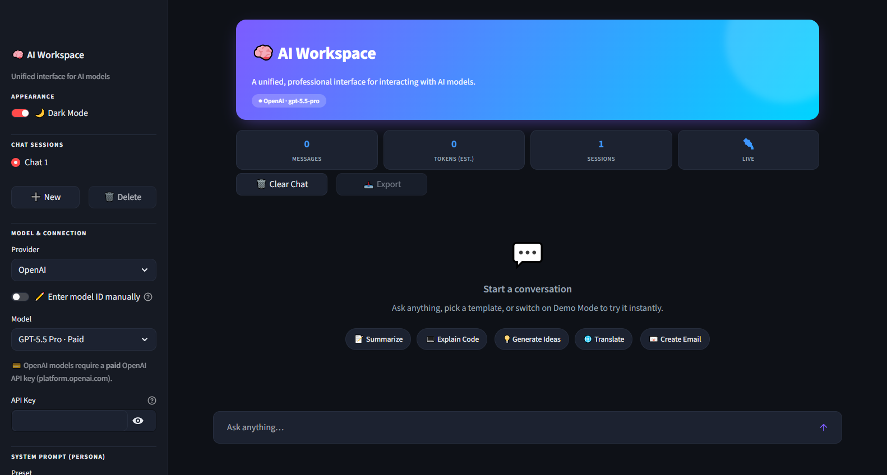
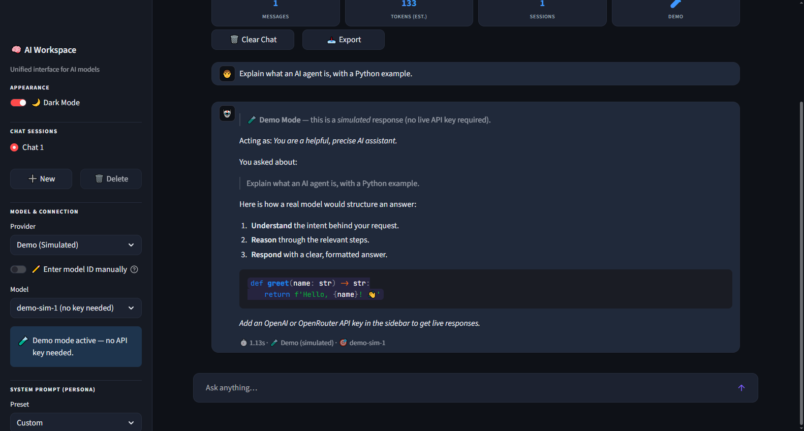
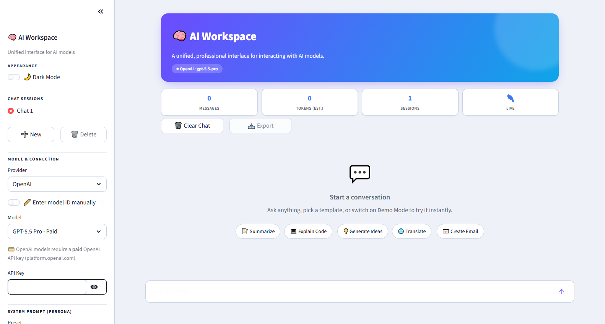

# 🚀 AI Agent Fellowship 2026

### _Visibility Bots Innovation Lab — Track 2: NLP & AI Agents_


Welcome to my official engineering repository for the **Visibility Bots Innovation Lab AI Summer Fellowship**. This space documents my transition from an AI consumer to an AI systems builder—housing enterprise-ready prototypes, system architecture schematics, and production-grade research logs.

> 🛠️ **Engineering Directive:** Week 1 focuses on building core developer habits, mastering deterministic LLM outputs, establishing error boundaries, and deploying unified workspace dashboards.

---

## 👤 Engineering Profile

### Core Information

- 🆔 **Name:** Rana Muhammad Haseeb Khan
- 🎓 **University:** FAST National University of Computer and Emerging Sciences _(Chiniot-Faisalabad Campus)_
- 🔍 **Current Focus:** Software Engineering — 6th Semester (Expected Graduation: 2027)
- 🎯 **Fellowship Track:** Track 2: NLP & AI Agents

### 🚀 Career Goals & Trajectory

I am a Software Engineer dedicated to architecting scalable, high-throughput intelligent software systems. My career trajectory focuses on bridging the gap between traditional robust backend microservices and next-generation autonomous models. I aim to build latency-optimized applications, full-stack data platforms, and real-time stateful multi-agent systems designed for predictable production deployment.

---

## 🛠️ Core Technical Stack

| Category                     | Technologies & Tools                                                     |
| :--------------------------- | :----------------------------------------------------------------------- |
| **Languages & Core**         | Python `3.11+`, JavaScript, TypeScript, PHP                              |
| **Frontend Frameworks**      | Next.js, React, Streamlit, Tailwind CSS                                  |
| **Backend & Databases**      | Node.js (MERN Stack), REST APIs, Supabase, MongoDB                       |
| **AI & Workflow Automation** | OpenAI API, Google Gemini API, LangChain, RAG Frameworks, n8n Automation |
| **DevOps & Environments**    | Docker, Git/GitHub, Linux (Kali/Ubuntu dual-boot systems)                |

---

## 🖥️ AI Workspace — Live Application

**AI Workspace** is a unified, professional interface for interacting with AI models — built with Streamlit. It supports multiple providers (OpenRouter · OpenAI · a keyless Demo mode), custom system-prompt personas, prompt templates, streaming markdown responses, multiple chat sessions, dark/light mode, token & latency telemetry, and robust error handling.

### 📸 Screenshots

**Dark Mode — Home**


**Live Conversation (Demo Mode) — streaming markdown & telemetry**


**Light Mode — Home**


### ⚙️ Quick Start

Full instructions in **[INSTALLATION.md](INSTALLATION.md)**.

```bash
pip install -r requirements.txt
streamlit run app.py
```

> 🧪 No API key? Select **Demo (Simulated)** as the provider to try the full UI instantly.

---

## 🎯 Specific Fellowship Learning Goals

1. **Stateful Agentic Architecture:** Evolve past elementary API wrappers to engineer autonomous, deterministic loop frameworks using advanced contextual memory layers and self-reflection mechanics.
2. **Production-Grade Prompt Engineering:** Master advanced structured output controls (forcing rigid JSON schemas via Pydantic parsing) and structural tool execution patterns while maintaining strict token/cost efficiency.
3. **Rigorous System Documentation:** Cultivate clean, industry-standard code discipline by backing all structural updates with comprehensive sequence flowcharts, metrics logs, and detailed research papers.

---

## 📂 Fellowship Phase Tracking

### Week 1 Deliverables

- **Assignment 1:** Professional Environment Validation & Repository Architecture
- **Assignment 2:** [Technical Research Report](RESEARCH_REPORT.md) — _"The Evolution of AI Agents and Modern AI Engineering"_
- **Assignment 3:** [AI Workspace Dashboard](app.py) — _Unified UI built with Streamlit featuring model toggling and custom system-prompt profiles._
- **Assignment 4:** [Prompt Engineering Experiments](PROMPT_EXPERIMENTS.md) — _Role, CoT, Few-Shot, JSON, and optimization trials with live outputs._
- **Assignment 5:** [Application Architecture](ARCHITECTURE.md) — _Request/response pipeline diagrams (Max 2 Pages)._
- **Assignment 6:** [Week 1 Builder Journal](BUILDER_JOURNAL.md)

### 📦 Repository Contents

| Deliverable                    | File                                           |
| :----------------------------- | :--------------------------------------------- |
| Source Code                    | [app.py](app.py)                               |
| Requirements                   | [requirements.txt](requirements.txt)           |
| Installation Guide             | [INSTALLATION.md](INSTALLATION.md)             |
| Research Report                | [RESEARCH_REPORT.md](RESEARCH_REPORT.md)       |
| Prompt Engineering Experiments | [PROMPT_EXPERIMENTS.md](PROMPT_EXPERIMENTS.md) |
| Architecture Diagram           | [ARCHITECTURE.md](ARCHITECTURE.md)             |
| Builder Journal                | [BUILDER_JOURNAL.md](BUILDER_JOURNAL.md)       |
| Screenshots                    | [screenshots/](screenshots/)                   |

---

_Engineered with focus by Rana Muhammad Haseeb Khan during the Visibility Bots Fellowship — 2026._
